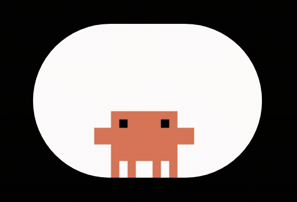

<h1 align="center">Hi there, I'm Rubén 👋</h1>
<h3 align="center">Full-Stack Engineer · Research Contributor · Building in quiet mode</h3>

  

  

 

I'm a **Full-Stack Developer** focused on transforming complex problems into efficient, scalable and robust software for large-scale projects. I care about clean architecture, pragmatic decisions, and systems that age well.

---

### 💻 Tech Stack

<strong>Core — daily driver</strong>

  

<strong>Also in the toolbox</strong>

  

---

### 🚀 About Me

- 🏢 Building Full-Stack solutions (Spring Boot + React) and working with **Liferay** at **Egarsat**.
- 🎓 Formalizing my foundations — Bachelor's in Computer Software Engineering at **UOC**.
- 🔬 Co-author of the research portal **[The Mutational Landscape of SARS-CoV-2](http://sarscov2-mutation-portal.urv.cat)** with **Universitat Rovira i Virgili**.
- 🌐 Personal portfolio → **[rubenitx.me](https://rubenitx.me)**
- 🌱 Currently diving into **LLMs** and the potential of **smart contracts** on-chain.
- 💬 Ask me about **Spring Boot, React, Liferay, or system design**.

---

### 🔨 Currently Building

> **Decoupled financial architecture** — Core API + Frontend · *in private mode, coming soon*
>
> A modular platform designed for independent evolution of the financial engine and the client layer. Focused on clean domain boundaries, observability, and long-term maintainability.

---

### 🔬 Featured Research

  <a href="http://sarscov2-mutation-portal.urv.cat">
    <strong>The Mutational Landscape of SARS-CoV-2</strong>
  </a> 
  Interactive portal for exploring mutations across the SARS-CoV-2 genome. Built in collaboration with <strong>Universitat Rovira i Virgili</strong> — contributing to the intersection of software engineering and bioinformatics.

---

### ☕ Special Touches

  

  <em>Building solid architectures, fueled by coffee. 
  Leveraging AI to code faster — not to think less.</em>

---

### 🎧 Coding Soundtrack

  

  <strong>Code in Flow</strong> 
  <em>Downtempo, electronic textures and ambient beats for long coding sessions.</em>

---

### 📫 Let's Connect
 

  
  
  
  

  <i>Open to conversations about ambitious backend, full-stack or research-oriented projects.</i>

